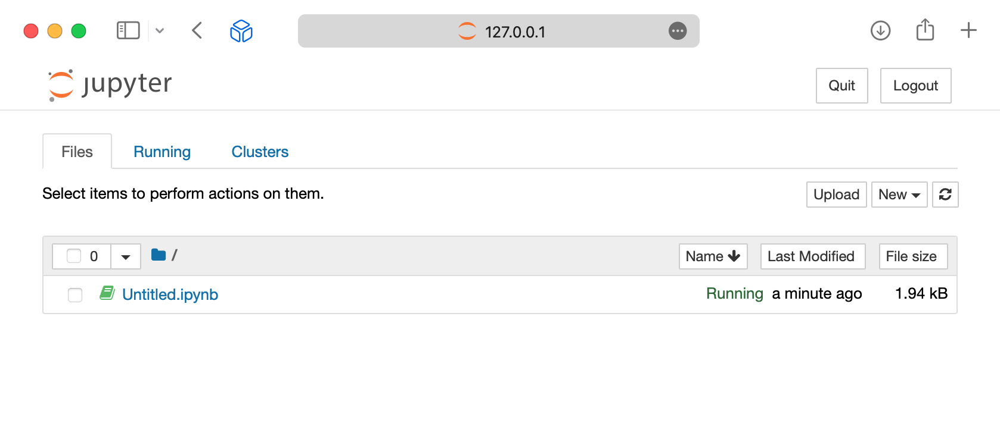

# Jupyter Notebook Workflow

The Jupyter Notebook is an open-source web application that allows you to create and share documents that contain live code, equations, visualizations and narrative text. Uses include: data cleaning and transformation, numerical simulation, statistical modeling, data visualization, machine learning, and much more. Visit [Jupyter.org](https://jupyter.org) for more information.

## Starting Jupyter on the Server

To work with Jupyter notebooks on the cluster, a typical workflow is as follows:
First, log into a node of the cluster where you'd like to run Jupyter on.

```sh
# For example:
ssh g1-7
```

Then, create a conda environment with your project dependencies and Jupyter.

```sh
conda create -n myproject -c conda-forge python=3.8 pandas notebook
conda activate myproject
```

Start Jupyter instance on the cluster that listens on the networking interface at port 8888. If you have used Jupyter before, the output of this command should look similar to what you see on your local machine.

```text
$ jupyter notebook --ip 0.0.0.0 --port 8888 --no-browser

[I 06:30:19.290 NotebookApp] Serving notebooks from local directory: /homes/jan
[I 06:30:19.290 NotebookApp] Jupyter Notebook 6.4.5 is running at:
[I 06:30:19.290 NotebookApp] http://g1-7.ikim.uk-essen.de:8888/       ?token=d6e1289f41b1433b557c06dd78c9d716180dc2a8ea61e8a9
[I 06:30:19.290 NotebookApp]  or http://127.0.0.1:8888/       ?token=d6e1289f41b1433b557c06dd78c9d716180dc2a8ea61e8a9
[I 06:30:19.290 NotebookApp] Use Control-C to stop this server and shut down all kernels (twice    to     skip confirmation).
[C 06:30:19.296 NotebookApp]

   To access the notebook, open this file in a browser:
       file:///homes/jan/.local/share/jupyter/runtime/nbserver-426528-open.html
   Or copy and paste one of these URLs:
       http://g1-7.ikim.uk-essen.de:8889/?token=d6e1289f41b1433b557c06dd78c9d716180dc2a8ea61e8a9
    or http://127.0.0.1:8889/?token=d6e1289f41b1433b557c06dd78c9d716180dc2a8ea61e8a9
```

Pay attention to the token in the output. In this case: `d6e1289f41b1433b557c06dd78c9d716180dc2a8ea61e8a9`. This is the password which will allow you to access to the Jupyter session once you have connected your local machine to the remote Jupyter Session.

## Connecting to the remote Jupyter

Finally, run the following command on your local machine, to setup an SSH tunnel that connects to the remote Jupyter session:

```sh
ssh g1-7 -N -L 8888:127.0.0.1:8888
```

Now your are ready to connect to your notebook on your local browser, you just need the url suggested by Jupyter when you started your session. For example: `http://127.0.0.1:8889/?token=d6e1289f41b1433b557c06dd78c9d716180dc2a8ea61e8a9`. When you open this link in your browser, you should see the familiar Jupyter home screen:



You can verify that this notebook is running on the remote host and within the conda environment as follows:


## First Time Setup

If you have not used Jupyter on the cluster before, you will need to initialize your config files and profile.[^1] This will generate new configuration files in `~/.jupyter` and `~/.ipython` for you.

[^1]: This section is based on <https://docs.hpc.sussex.ac.uk/apollo2/jupyter.html#first-time-setup-and-nfs-issue>

```sh
jupyter notebook --generate-config
ipython profile create
```

There is an issue that affects all Jupyter sessions where Jupyter and Ipython data directories reside on NFS mounts (specifically any of your research volumes or your HPC home directory). By default, Jupyter uses your home directory to store a couple of SQLite databases. However, due to an issue with file locking, SQLite is known to misbehave on some NFS mounts (see [here](https://www.sqlite.org/faq.html#q5)).

**How the problem presents itself:**
Your Jupyter sessions will simply hang and become unresponsive, as it will be stuck waiting for the SQLite databases’ files to be locked, which is not supported over NFS home directories.

**How to resolve the issue**
You will need to tell Jupyter and Ipython to use memory to store the database information instead of creating a file in your home directory. This can be done by editing the configuration files for Jupyter and Ipython. (Which you may have just created by following the instructions above).

```sh
# Edit Jupyter configuration
vi ~/.jupyter/jupyter_notebook_config.py

# Change following line
# c.NotebookNotary.db_file = ''

# To:
c.NotebookNotary.db_file = ':memory:'
```

```sh
# Edit IPython configuration
vi ~/.ipython/profile_default/ipython_config.py

# Change following two lines
# c.HistoryManager.hist_file=''
# c.HistoryAccessor.hist_file=''

# To:
c.HistoryManager.hist_file=':memory:'
c.HistoryAccessor.hist_file=':memory:'
```
